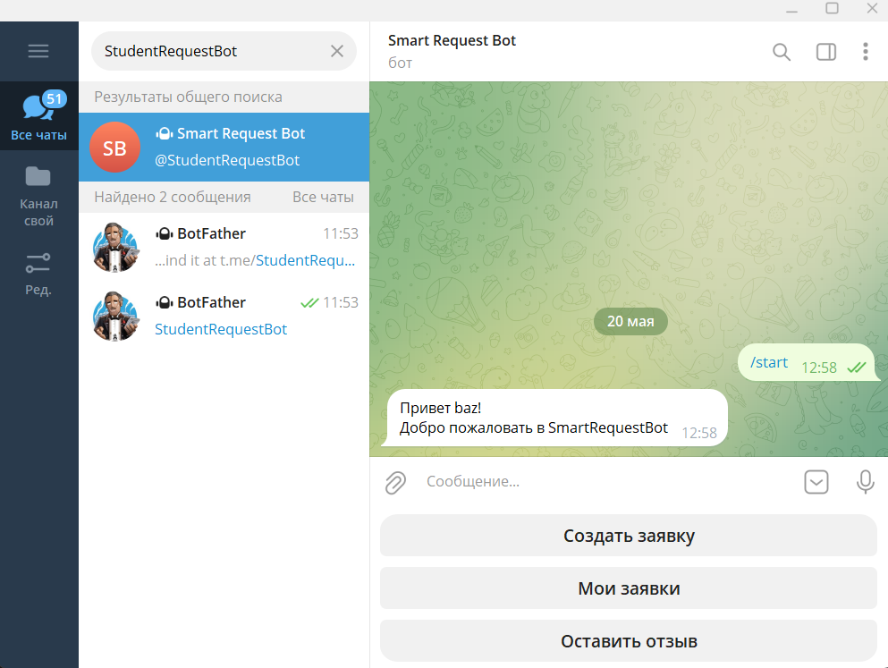
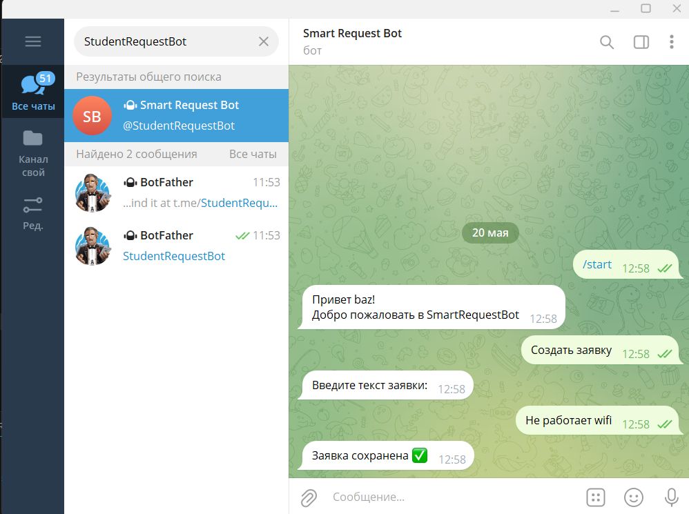
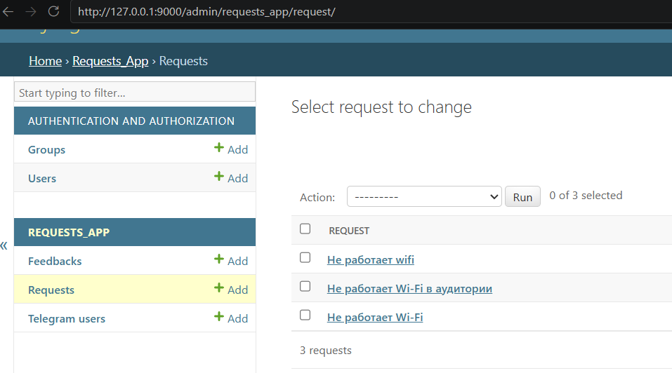

# SmartRequestBot

## Description
SmartRequestBot is a Telegram chatbot integrated with Django Admin and SQLite database.

The system allows users to:

- create requests
- view requests
- leave feedback
- save user data
- manage information through Django admin panel

## Technologies

- Python
- Django
- SQLite
- Aiogram
- Telegram Bot API

## Installation

1. Clone repository

git clone <repository-link>

2. Create virtual environment

python -m venv venv

3. Activate virtual environment

venv\Scripts\activate

4. Install requirements

pip install -r requirements.txt

## Run Django

python manage.py runserver 9000

## Run Telegram Bot

python -m bot.bot

## Main Features

- Telegram registration
- Requests management
- Feedback system
- Database support
- Django Admin panel

## Screenshots

## Screenshots

### Telegram Bot Start

### Create Request

### Requests in Django Admin

### Django Admin
